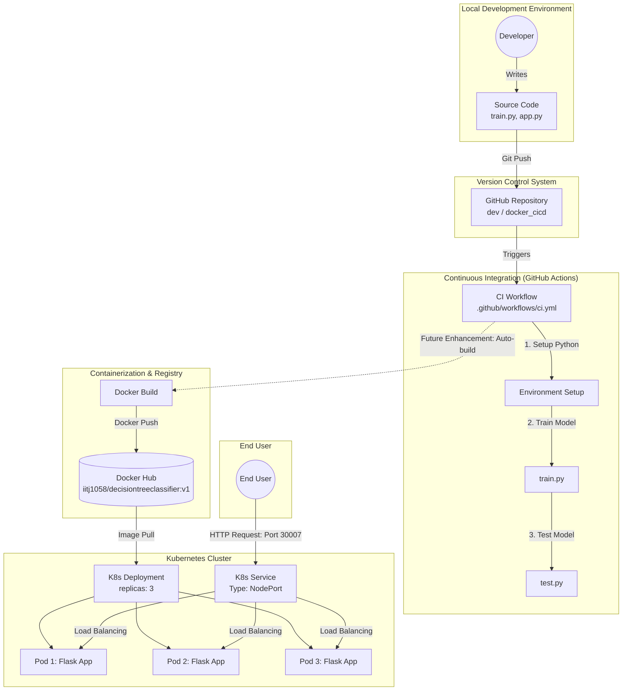

# MLOps Implementation and Architecture

Based on the project described in your workspace (Decision Tree Classifier with Docker, GitHub Actions, and Kubernetes), below is the optimal architecture design and a set of tough viva questions.

## 1. Architecture Design

The following Mermaid diagram illustrates the end-to-end MLOps architecture, highlighting the flow from local development to a scalable production deployment.

## 2. Tough Viva Questions

These questions are designed to test deep understanding of the architecture, design choices, and potential production issues for this MLOps pipeline.

### Machine Learning & Model Selection
1. **Model Choice & Overfitting:** You used a Decision Tree Classifier for the Olivetti Faces dataset. Decision Trees are prone to overfitting, especially on high-dimensional data like images. How did you ensure the model generalized well, and why not use an algorithm more suited for images, like a CNN or even SVM?
2. **Model Serialization Risks:** The model is saved and loaded using `joblib`. What are the security vulnerabilities associated with `joblib` or `pickle` in a production environment, and what safer alternatives exist for model serialization?

### Containerization & Docker
3. **Decoupling Model from Image:** Your Dockerfile likely copies the `savedmodel.pth` directly into the image. What are the architectural drawbacks of baking the model directly into the Docker image, and how would you redesign the system to separate model storage from the application code?
4. **Image Optimization:** The Docker image uses `python:3.11-slim`. While better than the full image, what further steps could you take (e.g., multi-stage builds) to minimize the attack surface and reduce the final image size for deployment?

### CI/CD Pipeline (GitHub Actions)
5. **Pipeline Expansion:** Currently, your GitHub Actions workflow trains and tests the model. If you wanted to fully automate the Docker image build and push to Docker Hub, how would you securely handle the Docker Hub credentials within GitHub, and what security risks must you mitigate?
6. **Data Versioning:** The pipeline relies on downloading the dataset via `scikit-learn` in the code. How would you handle a scenario where the training dataset needs to be updated frequently? What tools (e.g., DVC) would you integrate into this CI/CD pipeline to manage data versioning?

### Kubernetes Orchestration
7. **Service Exposure:** You exposed the application using a `NodePort` service. In an enterprise production environment, why is `NodePort` generally discouraged, and what are the benefits of using a `LoadBalancer` or an `Ingress` controller instead?
8. **Statelessness and Scaling:** Kubernetes is maintaining 3 replicas of your Flask app. Is your application strictly stateless? If an end-user uploads an image, and the request is distributed among the 3 pods, how does the system ensure the request is processed correctly without session persistence issues?
9. **Self-healing vs. Application Errors:** You demonstrated that deleting a pod causes Kubernetes to recreate it. However, if your Flask app starts throwing `500 Internal Server Error` due to a missing dependency, Kubernetes might not automatically restart the pod. How would you configure `liveness` and `readiness` probes to ensure Kubernetes can detect and handle application-level failures?

### Monitoring & Operations
10. **Model Drift:** The model is deployed and serving predictions. How would you monitor the model's predictive performance over time in this architecture to detect data drift (e.g., users uploading images quite different from the Olivetti faces)? What metrics would you expose and collect?
